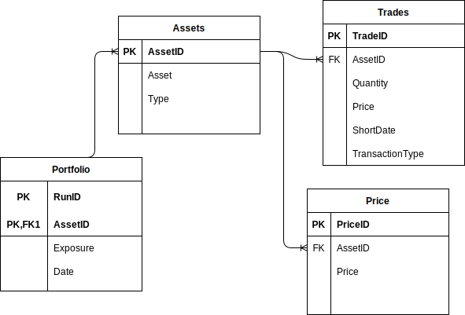

# pypir

Pypir is a simple library and database application that allows the user to track their portfolio.
As of now the package supports querying the yfinance api for stocks and the pycoingecko api for cryptocurrency.
Additionally as can be seen in the example database "demo.db" you can also add non-api holdings by adding the asset and giving it an associated price.

## pypir Datamodel

